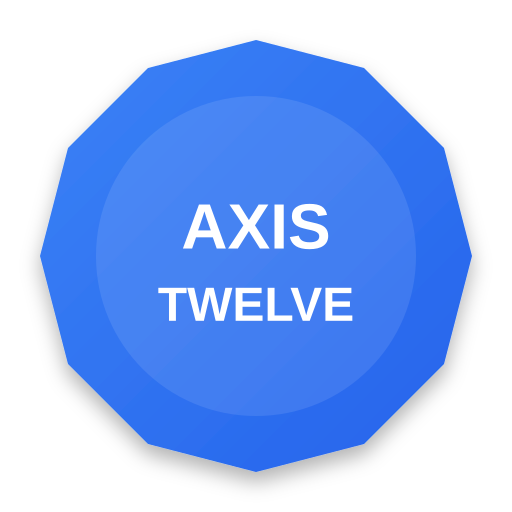

# Axis Twelve

  
  
<strong>Stable, Flexible, and Modular CSS framework solutions.</strong>

---

Welcome to the Axis Twelve project. We have transitioned to a versioned branch structure to better maintain the evolution of the framework.

## Project Versions

### [🚀 Axis Twelve v2.x (Modular)](https://github.com/dale-tomson/axis-twelve/tree/ver-2.x)
The modern, modular evolution of Axis Twelve. Built for scalability and zero-conflict integration.

- **Fully Modular Architecture**: Import only what you need (Buttons, Forms, Modals, etc.).
- **Zero Side Effects**: Components are self-contained with no global dependencies.
- **Modern BEM Naming**: Uses `.ax-` prefix to ensure zero conflicts with existing styles.
- **Rich Component Library**: Includes pre-built styles for Cards, Tooltips, Tables, and more.
- **Advanced Build Tooling**: Powered by pnpm and custom scripts for developer efficiency.
- **Enhanced Documentation**: Interactive, component-driven documentation with live examples.

### [📦 Axis Twelve v1.x (Stable)](https://github.com/dale-tomson/axis-twelve/tree/ver-1.x)
The classic, monolithic CSS framework. Simple, powerful, and ready to go.

- **Monolithic CSS Core**: Single-file approach for quick and easy integration.
- **12-Column Grid**: Powerful, responsive grid system defined by industry standards.
- **Centering Utilities**: Comprehensive set of classes for perfect horizontal and vertical alignment.
- **Extensive Spacing**: Named scale (xs to 3xl) for consistent padding and margin management.
- **Flexbox Ready**: Built-in utilities for modern flexbox layout control.
- **Lightweight & Fast**: Optimized for minimal impact on page load times.

---

License: MIT
